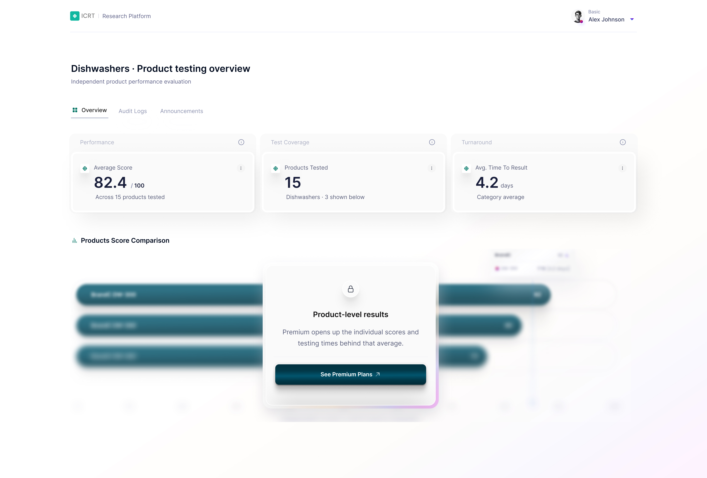
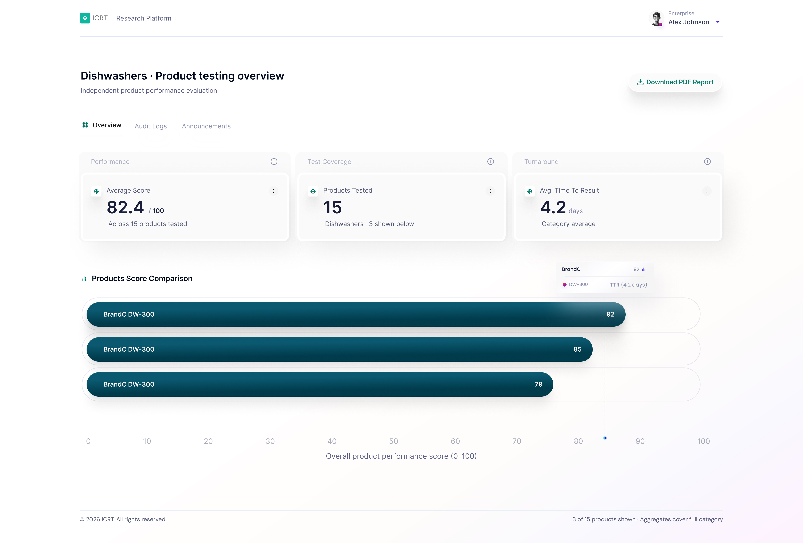

# ICRT Product Insights

A Vue 3 dashboard for exploring dishwasher test results at three subscription tiers.

_Basic: aggregate stats only, comparison gated._



_Premium: interactive chart, export unavailable._


_Enterprise: chart and active PDF export._



## Table of contents

- [ICRT Product Insights](#icrt-product-insights)
- [Table of contents](#table-of-contents)
- [Run locally](#run-locally)
- [Tech stack](#tech-stack)
- [Project structure](#project-structure)
- [Verification](#verification)
- [Testing](#testing)
  - [Vitest](#vitest)
  - [Playwright](#playwright)
  - [Continuous integration](#continuous-integration)
- [Part A decisions](#part-a-decisions)
- [Part B](#part-b)
  - [1. Database schema](#1-database-schema)
  - [2. API security](#2-api-security)
  - [3. Vetting AI-generated code](#3-vetting-ai-generated-code)
- [Notes](#notes)

## Run locally

Requires Node `^22.22.2` or `>=24.15.0` and npm `11.5.2`. Docker and CI use Node `22.22.2` and npm `11.5.2`.

```sh
npm ci
npm run dev
```

Open `http://localhost:3000`. Use the profile menu to switch between Basic, Premium and Enterprise.

Run the production image with Docker:

```sh
docker build -t icrt-product-insights .
docker run --rm -p 8080:80 icrt-product-insights
```

Open `http://localhost:8080`.

## Tech stack

| Tool           | Declared version                                                             | Why it is included                                                                          |
| -------------- | ---------------------------------------------------------------------------- | ------------------------------------------------------------------------------------------- |
| Vue            | `^3.5.40`                                                                    | Builds the dashboard from focused components and reactive entitlement state.                |
| TypeScript     | `~6.0.0`                                                                     | Checks component props, entitlement values and report data at build time.                   |
| Vite           | `^8.1.5`                                                                     | Runs the local server and produces the production bundle.                                   |
| Tailwind CSS   | `^4.3.3`                                                                     | Applies the responsive layout and design tokens without a separate component styling layer. |
| Chart.js       | `^4.5.1`                                                                     | Owns the score scale, responsive layout, bar geometry and hit testing.                      |
| jsPDF          | `^4.2.1`                                                                     | Generates the Enterprise PDF report directly from the data payload.                         |
| Vitest         | `^4.1.10`                                                                    | Runs component and entitlement tests in jsdom.                                              |
| Vue Test Utils | `^2.4.11`                                                                    | Mounts Vue components for interaction and rendering assertions.                             |
| Playwright     | `^1.61.1`                                                                    | Exercises the Basic, Premium and Enterprise journeys in Chromium.                           |
| ESLint         | `^10.7.0`                                                                    | Checks Vue and TypeScript rules that require type-aware or framework-aware analysis.        |
| Oxlint         | `^1.73.0`                                                                    | Runs the fast first lint pass across the repository.                                        |
| Prettier       | `3.9.5`                                                                      | Enforces one formatting result locally and in CI.                                           |
| Docker         | Node `22.22.2-alpine` build, `nginx:alpine` runtime                          | Builds in a clean Node environment and serves only the generated static files.              |
| GitHub Actions | `actions/checkout@v4`, `actions/setup-node@v4`, `actions/upload-artifact@v4` | Runs verification and Chromium end-to-end jobs on pushes and pull requests.                 |

## Project structure

```text
src/                              Application source.
├── assets/                       Global Tailwind theme, design tokens and shared CSS.
├── components/                   Vue components grouped by responsibility.
│   ├── dashboard/                Dashboard sections, chart presentation and tier controls.
│   │   └── __tests__/            Dashboard component specifications.
│   ├── icons/                    Local SVG icon components and shared gradient definitions.
│   └── ui/                       Reusable interface primitives.
│       └── __tests__/            UI primitive specifications.
├── data/                         Typed static testing payload supplied by the brief.
├── entitlements/                 Tier types and the central capability resolver.
│   └── __tests__/                Capability matrix specifications.
├── reports/                      PDF generation and intentionally empty optional-module aliases.
└── views/                        Page-level composition.
    └── __tests__/                Dashboard view specifications.
```

Components may depend on `entitlements` and `data`. Neither `entitlements` nor `data` may depend on components.

## Verification

Install Chromium once before running the Playwright script: `npx playwright install chromium`.

| Script                    | What it does                                                       |
| ------------------------- | ------------------------------------------------------------------ |
| `npm run dev`             | Starts the Vite development server.                                |
| `npm run build`           | Runs type checking and the production Vite build in parallel.      |
| `npm run preview`         | Serves the production build with Vite preview.                     |
| `npm run test:unit`       | Runs all Vitest specifications once.                               |
| `npm run test:unit:watch` | Runs Vitest in watch mode.                                         |
| `npm run test:e2e`        | Runs the Playwright end-to-end suite.                              |
| `npm run build-only`      | Builds the production bundle without running type checking.        |
| `npm run type-check`      | Runs the Vue TypeScript project build.                             |
| `npm run lint`            | Runs the fixing Oxlint and ESLint tasks in sequence.               |
| `npm run lint:check`      | Checks the repository with Oxlint and ESLint without fixing files. |
| `npm run lint:oxlint`     | Runs Oxlint and applies fixes.                                     |
| `npm run lint:eslint`     | Runs ESLint with fixes and its cache enabled.                      |
| `npm run format`          | Formats supported files with Prettier.                             |
| `npm run format:check`    | Checks Prettier formatting without changing files.                 |

## Testing

### Vitest

- `capabilities.spec.ts` checks the Basic, Premium and Enterprise capability matrices and confirms unknown inputs fall back to Basic.
- `DashboardView.spec.ts` confirms the Basic view does not mount the comparison, no product identifier reaches the DOM, the export control is hidden and disabled, and the upgrade action moves the simulation to Premium.
- `ReportExportButton.spec.ts` checks the unavailable button's visual and accessible state, refusal of click and keyboard actions, the enabled export event, and removal from layout when hidden.
- `TierSwitcher.spec.ts` checks tier selection, hover opening, arrow-key focus movement, Escape closing and focus return.
- `AccessGate.spec.ts` checks the gate copy, action label and emitted upgrade action.

### Playwright

- Basic asserts that `BrandA`, `BrandB`, `BrandC`, `DW-100`, `DW-200` and `DW-300` do not reach the DOM while the comparison is gated.
- Premium asserts that the export button remains visible and keyboard focusable, exposes its gate explanation, and produces no download when activated with Enter.
- Enterprise asserts that clicking export produces a download named `dishwashers-product-report.pdf`.

### Continuous integration

- `verify` installs the pinned npm version and clean dependencies, then runs formatting, linting, type checking, unit tests, the production build and the Docker build.
- `e2e` runs after `verify`, installs Chromium and its system dependencies, runs the Chromium Playwright project, and uploads the Playwright report when the job fails.

## Part A decisions

- The supplied aggregates cover 15 products, while the payload contains three product records. The dashboard shows "3 of 15" and does not recalculate the aggregates from a different set.
- The comparison uses horizontal bars. They use the wide layout well, keep product labels readable, and can extend downwards as more products are added. A bullet chart was considered, but it asks readers to learn a less familiar visual grammar.
- Time to result is shown in the tooltip and accessible table, not as a second chart series. Score and time measure different things, and three records cannot support an implied correlation.
- Chart.js owns the scale, responsive layout, bar geometry and hit testing. Custom plugins draw the branded tracks and in-bar labels, while the external Vue tooltip keeps the presentation consistent with the rest of the interface.
- Basic sees a blurred skeleton, not blurred product data. CSS blur is not an access control and no product identifier reaches the DOM.
- Premium can focus the unavailable export button and read why it is unavailable. `aria-disabled` is advisory, so the click and keyboard handlers also refuse the action.
- The chart is loaded only after the comparison capability is granted. PDF code is loaded only when an Enterprise user exports. The main path does not pay for either dependency up front.
- There is no router, store, shared button abstraction or composable with one consumer. Those mechanisms do not solve a current problem in this single-page application.

The tier control is a demonstration harness. In production, entitlements would come from the authenticated session and current subscription, not from a user-controlled menu. The brief explicitly requires the static payload to be parsed in the frontend, so product values exist in the built JavaScript for this exercise. Part A therefore demonstrates gating UX, not secure data access. A production Basic API response would omit product-level fields at the server boundary.

## Part B

### 1. Database schema

One PostgreSQL database.

The data is relational and it has to stay consistent. An evaluation belongs to a product, a product to a category, an entitlement to a subscription. "Which products has this organisation paid to see" is a join. Deleting a product has to remove its evaluations, metrics and reports in the same transaction, or the corpus is left half deleted. ICRT's whole product is that its published results are citable, so two members reading different versions of the same evaluation is worse than a slow query.

```text
organisations       id PK, name, country, created_at
users               id PK, organisation_id FK, email UNIQUE, role
plans               id PK, code UNIQUE, name
plan_features       (plan_id FK, feature_code) composite PK, enabled
subscriptions       id PK, organisation_id FK, plan_id FK, status,
                    starts_at, ends_at

categories          id PK, name UNIQUE
products            id PK, category_id FK, brand, model
                    UNIQUE (category_id, brand, model)
laboratories        id PK, name, accreditation_code UNIQUE
evaluations         id PK, product_id FK, laboratory_id FK,
                    protocol_version, sample_received_at,
                    published_at, composite_score
metric_definitions  id PK, category_id FK, code, label, unit,
                    scale_min, scale_max, weight,
                    contributes_to_score
                    UNIQUE (category_id, code)
test_metrics        (evaluation_id FK, metric_definition_id FK)
                    composite PK, value numeric
reports             id PK, evaluation_id FK, download_id UNIQUE,
                    storage_key UNIQUE, created_at
events              id PK, organisation_id FK, user_id FK,
                    occurred_at, event_type, properties jsonb
```

Metrics are rows, not columns. A published score is a composite, not a measurement. It is made of weighted sub-measurements, and comparative testing also captures attributes that are useful to the reader but deliberately do not feed the overall score. That is what weight and contributes_to_score are for. Storing criteria as rows means dishwashers and cameras carry different test criteria without a migration per category.

It costs something. You lose column-level type constraints, and comparing two criteria across products needs a pivot. The alternative is a jsonb blob on evaluations, quicker to write but giving up referential integrity over which criteria exist. I went with rows because ICRT's value is comparability across members and markets, and comparability needs a fixed vocabulary of criteria. Qualitative ratings are stored as documented ordinals rather than free text.

ttr_days is derived, not stored. It is published_at - sample_received_at. Storing it invites drift the first time someone corrects a publication date and forgets the derived column. The category aggregates are a materialised rollup refreshed on publication, not computed per request.

Entitlements are data. plan_features means changing what a tier includes is a row update, not a deploy. It is the same shape as the frontend capability map: a plan resolves to a set of feature codes. Effective entitlements are the sum of the active plan, any inherited base plan, add-ons and trials, most generous wins.

Indexes. I would not guess at these. You find the slow queries first, then index what those queries filter and sort on. Most tables end up with three to five. Adding them speculatively costs write throughput and gives you nothing back.

Some are derivable from the schema before any traffic exists, because Postgres does not index foreign keys automatically and these are joined on every request: products(category_id), test_metrics(evaluation_id), users(organisation_id), reports(download_id).

Two composites, because of how the queries are actually shaped. Nobody asks what was published most recently across the whole corpus. They ask for the latest evaluation for a product:

```sql
CREATE INDEX ON evaluations (product_id, published_at DESC);
CREATE INDEX ON evaluations (category_id, published_at DESC);
```

Equality column first, sort column last. Postgres walks straight to that product's rows and they are already in date order. A standalone index on published_at cannot serve that, because it would scan every product's evaluations and filter.

One partial index, because entitlement resolution runs on every request and only ever wants the active subscription:

```sql
CREATE INDEX ON subscriptions (organisation_id) WHERE status = 'active';
```

Indexing years of expired rows wastes space and slows writes. status on its own is three values, so it belongs in the predicate rather than as an indexed column.

Everything else waits for EXPLAIN ANALYZE on a query that is actually slow.

Behavioural events. The gating decision was to show Basic users what Premium unlocks rather than hide it. Hiding is RBAC behaviour and it removes the upgrade path. That creates an obligation to measure whether it works, so the platform needs an event stream: upgrade prompt shown, upgrade prompt clicked, plan changed.

Those events are structured, not unstructured. Every one has an organisation, a user, a timestamp, an event type and a properties object. What makes them different from the tables above is the write pattern: append only, never updated, high volume relative to the corpus, different retention. So they get their own table with a jsonb properties column, kept off the transactional path so an analytical query cannot slow down result publication. The trigger to move them to a dedicated event store is write volume, not the shape of the data.

At roughly forty member organisations this stays a single instance. The trigger to revisit is the corpus outgrowing what one read replica serves comfortably, not a user count.

### 2. API security

The frontend gate is user experience. It is not security, and it was never meant to be. Anything running on the client can be edited by the client.

Authentication answers who you are. Authorisation answers what you may do. Both run on every request: the token proves identity, the current subscription resolves entitlement, and the organisation scope decides which rows are visible.

The backend authenticates the token, resolves the user's organisation and current entitlements, checks the capability, and only then queries or serialises product fields. When the capability is absent it returns 403 with `{ allowed: false, reason: 'insufficient_tier', requiredPlan: 'premium' }`, so the client can render a specific prompt rather than a generic one.

**The gate is not the chart, the tooltip, the table or the PDF. The gate is whether the API returns product-level fields. Everything downstream follows automatically, because a component cannot render data it never received. That is one enforcement point instead of four.**

That framing matters because the alternative is a check at every surface, and every one of those is a place the rule can drift.

The endpoints:

```
GET /api/v1/categories/dishwashers
    200  aggregate_stats always
         products[] only when view_product_results is held

GET /api/v1/reports/eval_889
    302  short-lived signed URL
    403  otherwise
```

One URL returns different shapes by entitlement rather than there being a separate privileged route. There is no `/premium/` path to discover, and one endpoint means one check.

Report download works the same way. The client holds an opaque `download_id`, not a storage path. The endpoint repeats the organisation and capability check and returns a short-lived signed URL. An ID on its own grants nothing, so guessing `eval_892` returns 403 rather than a file. Denials and downloads are both audited, and the report endpoint is rate limited per organisation because it is the expensive one and the one worth scraping.

**Where the checks live.** Permissions sit at four layers and only one of them is a control.

The frontend layer is UX. It hides what a user cannot act on so they are not surprised. It is trivially bypassable and nothing depends on it.

The transport layer is the control. Every endpoint resolves entitlements at the top of the handler, before any query runs. A missing check here is the vulnerability, which is why it is one function rather than a pattern copied per route.

The data access layer is defence in depth. Field-level rules mean `composite_score` and `test_metrics` are only serialisable when the caller holds `view_product_results`. If someone adds an endpoint and forgets the transport check, the fields still do not serialise.

The database layer enforces integrity rather than permissions: uniqueness, foreign keys, the constraint that a test metric belongs to exactly one evaluation. Users never touch it directly, but it is what stops an application bug corrupting the corpus.

To prove the transport check has not been forgotten on a new route, a test hits every endpoint with a Basic token and asserts no product field appears in any response body. That is the server-side twin of the Playwright spec asserting no product identifier reaches the DOM.

**403 rather than 404.** 404 hides that the resource exists and is right when the existence itself is confidential. 403 with a reason is right here, because ICRT wants Basic users to know product-level data exists and can be unlocked. It is the same gate-versus-hide decision as the UI, applied to status codes.

**What happens when someone had the feature and now does not.** Capabilities are resolved per request from the current subscription rather than cached in the session, so a downgrade takes effect on the next call. The client handles a 403 mid-session by degrading into the same locked state it would have shown proactively. That is why the gate component is driven by capability rather than by tier: the reactive path and the proactive path render the same thing.

The tier is never a claim the client carries. A stolen token cannot be edited to say Enterprise, because the entitlement is resolved server-side from the subscription on every request.

Two checks, not one. Feature gating answers whether the customer paid for a capability. RBAC and organisation scoping answer whether this user may see this particular resource. A Premium user from one member organisation still cannot read another organisation's unpublished evaluations. Both apply on every request.

At larger scale I would cache entitlement resolution briefly with explicit invalidation on subscription change, but the API response boundary stays the enforcement point.

### 3. Vetting AI-generated code

The hard part is not generating code, it is reading it. Most engineers were trained to write, not to read unfamiliar code. Given a diff, people scroll top to bottom like a book and come out with no model of what happens. Code is a graph of what calls what, not a narrative.

Two things I look for specifically.

Authorisation written into presentation code. Given a gating requirement, a model puts the check where the UI needs it. You end up with tier === 'premium' scattered through components. Every one is a place the rule can drift, and none of them is a control, because they all run on the client.

In this repo the rule lives in one file. Components ask resolveCapabilities for a capability, never for a tier. Adding a fourth tier is a compile error until every capability is declared, because the map is typed Record<Tier, Capabilities>. Unknown input resolves to Basic, so it fails closed.

How I vet it: a grep that fails if a tier string appears outside src/entitlements, and a committed rules file constraining what the tooling may generate. The Playwright spec asserts no product identifier reaches the DOM on Basic, which is the executable form of the same claim. Against a real API I would add a test proving a Basic token cannot fetch product fields or a report by guessing its ID.

Work in the render path. Models write code that is correct and expensive. The first version of the chart component called getComputedStyle(document.documentElement) inside the bar fill callback and inside a draw plugin. Both run per bar, per frame, inside a requestAnimationFrame loop. That is a forced style recalculation roughly a dozen times a frame, for values that never change after mount.

Nothing about it looks wrong when you read it. It passes tests. It only shows up when you ask what runs per frame. The tokens are now read once on mount into a frozen object and everything reads from that.

How I vet it: for anything inside a render loop or an event handler I trace what runs per frame, then confirm it in the performance profiler rather than trusting the read.

How I read a diff I did not write. Find the entry point, the code that talks to the outside world, and follow calls outward rather than reading files in order. Read the tests first, because they state the contract. Then follow the data rather than the functions: pick the variable that matters and trace where it is created, checked and returned, because that tells you which checkpoints are load bearing. Skip anything that does not change the request, block the flow or explain a bug.

Then read one failure path as an attacker. On a login handler: does the error differ when the email exists versus when it does not, and does the wrong-password branch take measurably longer than the user-not-found branch? Either one lets someone enumerate accounts, and a model will write both without noticing.

Last step is compression. If I cannot write down in one line what the code does, I looked at it, I did not read it.

Automation owns what automation owns. Formatting to Prettier, static hygiene to the linters, type compatibility to the compiler, behaviour to Vitest and Playwright, installability to npm ci in a clean container in CI. This repo surfaced three dependency defects that way, all invisible locally: a peer conflict, a lockfile written by a different npm major than the runtime image, and an invalid hoisted picomatch. Review attention goes on what none of those catch: responsibility placement, dependency direction, invariants, state ownership and what runs per frame.

The constraints are committed in .cursor/rules/, so the checks applied to generated code are reviewable rather than claims made afterwards.

## Notes

picomatch is pinned to v4 via overrides. npm hoisted v2 to the root
for micromatch, which violated the ^3 || ^4 peer range that fdir
requires inside Vite's tinyglobby. The tree ran fine locally but
npm ci correctly refused it.

html2canvas, dompurify and canvg are aliased to an empty module in
vite.config.ts. jsPDF pulls them in for its .html() rendering path,
which this report does not use. Removing them cut 378 KB of async
chunks. The PDF is generated from the payload directly rather than
from DOM capture, so the aliased modules are never reached.
