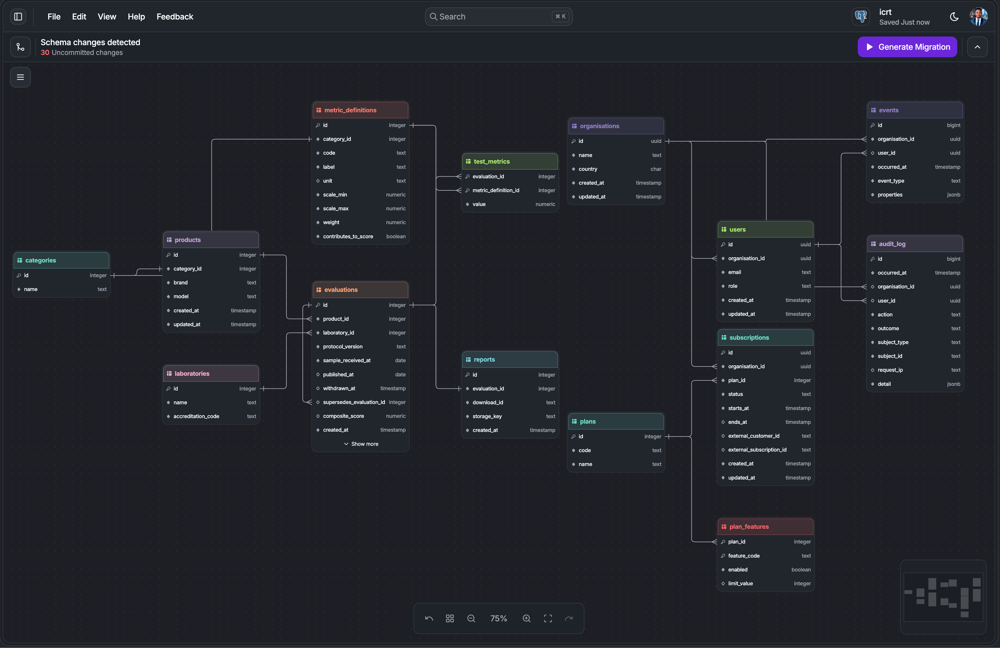

# ICRT Product Insights

A responsive Vue dashboard for exploring dishwasher test results across Basic, Premium and Enterprise access levels. It was built for a time-boxed technical assessment that also asked for a proposed backend schema, an API security approach and an explanation of how AI-generated code should be reviewed.

[Repository](https://github.com/ronniekiyegga/icrt-product-insights)


## Assessment scope

The supplied brief required a single-page Vue dashboard, a tier switcher, subscription-based feature gating and use of the supplied static product payload. The implementation adds a responsive Chart.js comparison, accessible gated states, an Enterprise PDF export, unit and browser tests, CI and a production Docker image.

The brief explicitly places the static payload in the frontend. Product data therefore exists in the built JavaScript for this exercise. The application demonstrates gating behaviour and prevents Basic product identifiers from reaching the DOM, but it does not claim that client-side code is a security boundary.

## Feature access

| Tier       | Category aggregates | Product comparison         | PDF report              |
| ---------- | ------------------- | -------------------------- | ----------------------- |
| Basic      | Available           | Gated with upgrade context | Hidden                  |
| Premium    | Available           | Available                  | Visible but unavailable |
| Enterprise | Available           | Available                  | Available               |

<details>
<summary>Basic: aggregate stats only, comparison gated</summary>


</details>

<details>
<summary>Premium: interactive chart, export unavailable</summary>


</details>

## Engineering decisions

### Capability-based entitlements rather than tier checks

**Decision:** Components ask for `viewAggregates`, `viewComparison` and `exportReport` capabilities instead of checking strings such as `tier === 'enterprise'`.

**Why:** Commercial tier names and application behaviour can change independently. The typed `Record<Tier, Capabilities>` requires every known tier to declare every capability, while unknown input falls back to Basic. A future bespoke plan can resolve to the same capability shape without changing each component.

**Trade-off:** This adds a policy layer that is more abstract than the three fixed tiers strictly require.

### Gating controls what is mounted, not only what is visible

**Decision:** Basic renders a blurred skeleton and upgrade prompt rather than rendering product data and hiding it with CSS. The real comparison component is not mounted.

**Why:** Blur and `display: none` do not prevent data from reaching the DOM. The Basic unit and Playwright tests explicitly reject all supplied brand and model identifiers.

**Trade-off:** This improves the frontend boundary but cannot secure a payload shipped to the browser. A real backend must omit product-level fields before serialisation.

### Chart.js owns geometry while Vue owns presentation and accessibility

**Decision:** Chart.js provides the scale, responsive bar geometry and hit testing. Local plugins draw the tracks, layered shadows and in-bar labels. Vue renders the external tooltip, visible scale and screen-reader table.

**Why:** Reimplementing chart layout would duplicate tested geometry, while the extension points allow the required visual treatment. Keeping tooltip content and the accessible table in Vue produces normal DOM that can be styled and announced independently of canvas drawing.

**Trade-off:** Manual event handling and canvas plugins are more code to test than a default Chart.js theme. The screen-reader table must remain in sync with the chart payload.

### Heavy features load only when used

**Decision:** The comparison is loaded with `defineAsyncComponent`, and jsPDF is dynamically imported only when an enabled export runs. The report is generated from the payload rather than by capturing the DOM.

**Why:** Basic users do not need Chart.js, and chart viewers do not need PDF code until export. Data-driven PDF generation is deterministic and independent of viewport layout. The unused jsPDF DOM-rendering dependencies are aliased to an empty module in Vite.

**Trade-off:** Premium and Enterprise have a first-load delay for the chart, and the first export waits for the PDF chunk.

### Metrics are relational rows rather than JSON fields

**Decision:** The proposed schema separates metric definitions from measured values. An evaluation has many `test_metrics`, each linked to a category-specific definition.

**Why:** Product categories can use different criteria without a schema migration, while definitions preserve a shared vocabulary, units, ranges and score weighting. This supports comparison better than an unconstrained JSON object.

**Trade-off:** Cross-product reporting needs joins and sometimes a pivot. A JSON payload would be quicker to store but weaker for integrity and comparison.

## Assumptions and scope

The brief leaves several domain questions open. I made explicit assumptions to complete a coherent design without treating them as requirements:

- **Organisation-level subscriptions:** I modelled the product as B2B, with an organisation holding a subscription and one or more users belonging to it. If subscriptions are per person, the subscription foreign key can point to `user_id` instead.
- **Bespoke capabilities:** Plans resolve to feature codes rather than an ordered tier rank. This allows an organisation-specific entitlement set, but the brief only requires Basic, Premium and Enterprise.
- **Shared test corpus:** Products, evaluations and metrics are shared reference data. Accounts, subscriptions and audit records are organisation-scoped. Entitlement changes which fields an API returns, not which corpus rows exist.
- **Events and releases:** I introduced an event or release idea as a possible way to group batches of published testing results. The brief does not state that such batches exist. The ERD also uses events for observability, so production discovery should decide whether publication releases and behavioural events are separate concepts and name or remove them accordingly.

In a production discovery process, I would validate these assumptions with product and domain stakeholders before extending the model further. I would not introduce separate services, event-driven architecture, additional storage systems, caching layers or more domain entities until requirements or measured scale justify them.

## Architecture

The frontend dependency direction is:

```text
main.ts / App.vue -> DashboardView -> dashboard components -> shared UI and icons
                                  -> entitlements, data and reports
```

`data` and `entitlements` do not import components. `DashboardView` owns page state and orchestration, the entitlement module owns access policy, and components render the resolved outcome.

The backend below is a proposal, not an implemented service.



Blue represents accounts and entitlements, green the shared test corpus, and purple observability.

The proposed PostgreSQL model has three groups:

- **Accounts and entitlements:** `organisations`, `users`, `plans`, `plan_features` and `subscriptions`.
- **Test corpus:** `categories`, `products`, `laboratories`, `evaluations`, `metric_definitions`, `test_metrics` and `reports`.
- **Observability:** `events` and `audit_log`.

Primary and foreign keys enforce ownership of products, evaluations, measurements and subscriptions. `plan_features` and `test_metrics` use composite primary keys. Natural identifiers such as user email, plan code, report download ID and category metric code are unique. Evaluations can be withdrawn or supersede an earlier result rather than rewriting published history.

Indexes follow known request paths: organisation lookup for users and active subscriptions, category lookup for products, evaluation lookup for metrics and laboratory attribution. A partial `(product_id, published_at DESC)` index covers only published, non-withdrawn evaluations. Organisation and time indexes support event queries, with a partial audit index for denied outcomes. Further indexes should be driven by `EXPLAIN ANALYZE`, because every index adds write and storage cost.

## Security

Frontend gating is user experience only. In the proposed backend, every protected request would:

1. authenticate the token;
2. resolve the current user, organisation and subscription capabilities;
3. apply organisation and resource scope;
4. query and serialise only the fields the capability permits.

The category endpoint can always return aggregates but only include `products[]` when `view_product_results` is present. The enforcement point is the API response boundary, so the chart, tooltip, table and report all receive the same safe shape rather than implementing separate security checks.

Report download would accept an opaque `download_id`, repeat the organisation and capability checks, and return a short-lived signed URL. Guessing an ID grants nothing. Downloads and denials would be audited, and the report endpoint would be rate limited because it is expensive and attractive to scrape.

Feature entitlement and RBAC are separate checks. Paying for product results does not allow a user to access another organisation's private resources. Capabilities should be resolved from server-side subscription data rather than trusted from a client claim.

## Vetting AI-generated code

I focus review on two failure modes that can look plausible and still pass model-generated tests.

1. **Authorisation in presentation code.** A model may scatter tier checks through components, creating inconsistent gates that remain bypassable. I constrain the design to one capability resolver, search for tier checks outside it and test unknown input as Basic. For a real API, I would also verify that Basic responses and the rendered DOM contain no protected fields.
2. **Hidden work in hot paths.** A model may place correct but expensive work inside render or animation callbacks. An earlier chart version repeatedly called `getComputedStyle` per bar and draw. Tracing what runs per frame exposed it, and the chart now reads its tokens once on mount. I review call paths, use current library documentation, profile runtime behaviour and leave formatting, types, lint rules and installability to automated checks.

AI output is treated as an untrusted draft. The useful review questions are where responsibility sits, what data crosses a boundary, what runs repeatedly, and whether the tests were written independently of the implementation's assumptions.

## Testing and quality

| Layer                     | What it verifies                                                                                                                                      |
| ------------------------- | ----------------------------------------------------------------------------------------------------------------------------------------------------- |
| Vitest and Vue Test Utils | Capability resolution, fail-closed input, Basic DOM exclusion, gate behaviour, export refusal and emission, tier-menu interaction and keyboard focus. |
| Playwright in Chromium    | Basic product identifiers remain absent, Premium export stays focusable but produces no download, and Enterprise downloads the expected PDF.          |
| Static checks             | Prettier, Oxlint, ESLint and `vue-tsc` run against the repository.                                                                                    |
| CI `verify` job           | Clean install, format, lint, types, unit tests, production build and Docker build.                                                                    |
| CI `e2e` job              | Runs after `verify`, installs Chromium, executes the three tier journeys and uploads the report on failure.                                           |

The Basic browser test is the highest-value frontend contract. It verifies the assembled page does not merely obscure protected identifiers.

Run all local checks with:

```sh
npm run format:check
npm run lint:check
npm run type-check
npm run test:unit
npm run test:e2e
npm run build
```

Install Chromium once with `npx playwright install chromium`.

## Running locally

Requires Node `^22.22.2` or `>=24.15.0` and npm `11.5.2`.

```sh
npm ci
npm run dev
```

Open `http://localhost:3000` and use the profile menu to switch tiers.

## Deployment

The multi-stage Dockerfile builds with Node `22.22.2-alpine` and serves only the generated `dist` files from nginx:

```sh
docker build -t icrt-product-insights .
docker run --rm -p 8080:80 icrt-product-insights
```

Open `http://localhost:8080`.

The Docker build in CI proves the repository can produce the runtime image in a clean environment. There is no live deployment target configured in this repository.

## Further work

1. Validate organisation ownership, bespoke plans and release grouping with stakeholders, then simplify or extend the schema from evidence.
2. Implement the backend response boundary, organisation scoping and signed report URLs before treating the data gate as secure.
3. Add server contract tests proving a Basic token cannot retrieve product fields or reports by guessed ID.
4. Add ingestion, publication and withdrawal workflows when the source and lifecycle of real testing data are known.
5. Add entitlement quantities such as seat or download limits only if packaging becomes usage-based.
